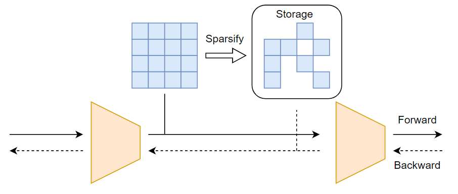

# Back Razor

## Introduction
Transfer learning from the model trained on large datasets to customized downstream tasks has been widely used 
as the pre-trained model can greatly boost the generalizability. However, the increasing sizes of pre-trained models also 
lead to a prohibitively large memory footprints for downstream transferring, making them unaffordable for personal devices. 
Previous work recognizes the bottleneck of the footprint to be the activation, and hence proposes various solutions such as 
injecting specific lite modules. In this work, we present a novel and general framework called Back Razor, that can be 
plug-and-play applied to any pre-trained network without changing its architecture. The key idea of 
Back Razor is asymmetric sparsifying: pruning the activation stored for back-propagation, while keeping the 
forward activation dense. It is based on the observation that the stored activation that dominates the memory footprint 
is only employed on back-propagation. Such asymmetric pruning avoids affecting the forward computation, thus making more aggressive 
pruning possible. Furthermore, we conduct the theoretical analysis for the convergence rate of Back Razor, showing that under mild conditions, 
our method retains a similar convergence rate as vanilla SGD. Extensive experiments on both Convolutional Neural Networks and Vision 
Transformers show that Back Razor could yield up to 97% sparsity, saving 9.2x memory usage, without losing accuracy.

## Method


## Environment Setting
```shell
conda create -n backRazor python=3.7 -y
conda activate backRazor

# Install PyTorch, we use PyTorch 1.7.1 with CUDA 10.1 
pip install torch==1.7.1+cu101 torchvision==0.8.2+cu101 torchaudio==0.7.2 -f https://download.pytorch.org/whl/torch_stable.html

# Install ninja
pip install ninja

# Install Mesa
git clone https://github.com/zhuang-group/Mesa
cd Mesa/
# You need to have an NVIDIA GPU
python setup.py develop
cd ..

# install ofa
pip install ofa

pip install tqdm
pip install -U scikit-learn

pip install tensorboard tensorboardX
pip install ml_collections
```

## Dataset Setting
```shell
cd dataset_setup_scripts
bash make_all_datasets.sh
cd ..
```

## Pretrain Model download
```shell
# for ViT
mkdir pretrain
cd pretrain
wget https://storage.googleapis.com/vit_models/imagenet21k/ViT-B_16.npz
cd ..
```

## Running Cmds
Can be found in [cmds](cmds) directory

## Acknowledge
The partial code of this implement comes from [TinyTL](https://github.com/mit-han-lab/tinyml/tree/master/tinytl), [Mesa](https://github.com/zip-group/Mesa) and [ViT-pytorch](https://github.com/jeonsworld/ViT-pytorch)

## Cite
```shell
@inproceedings{
jiang2022back,
title={Back Razor: Memory-Efficient Transfer Learning by Self-Sparsified Backpropogation},
author={Jiang, Ziyu and Chen, Xuxi and Huang, Xueqin and Du, Xianzhi and Zhou, Denny and Wang, Zhangyang},
booktitle={Advances in Neural Information Processing Systems 36},
year={2022}
}
```
